# Week 1 Extra Project — Setting Up Android-x86 in VirtualBox (Networked with Kali Linux)

**Program:** NETWORKWALKS CYBERSECURITY INTERNSHIP — Week 1
**Author:** Patrick Alabi

## Project Goal

Set up an Android-x86 virtual machine inside VirtualBox, place it on the same NAT Network as an existing Kali Linux VM, and confirm bidirectional connectivity between both machines and the internet.

This extends the multi-OS home-lab environment (alongside the Windows 10 build from the same week) with a third, lightweight guest OS for future testing and reconnaissance exercises.

## Requirements

- VirtualBox already installed (same instance used for Kali)
- At least 10 GB free disk space
- At least 2 GB RAM to spare for the VM
- Kali Linux VM already configured on a NAT Network, IP `10.0.0.2`

## Network Summary

| Setting | Value |
|---|---|
| Network type | VirtualBox NAT Network |
| Kali Linux IP | 10.0.0.2 / 24 |
| Android 9.0 IP | 10.0.0.9 / 24 |
| Gateway | 10.0.0.1 |
| DNS | 8.8.8.8 |

## What Was Done

1. **Downloaded the Android-x86 9.0 ISO** from the official Android-x86 project page / SourceForge release folder (64-bit build, avoiding third-party mirrors).

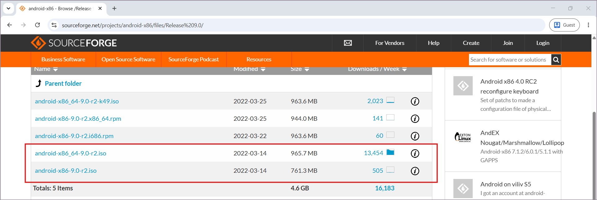

3. **Created a new VM in VirtualBox** — named `Android9-Lab`, OS type Linux / Other Linux (64-bit), 2048 MB RAM, 2 CPUs, 10 GB VDI virtual disk.

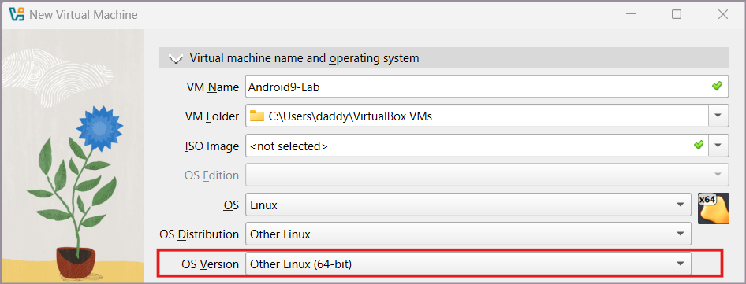

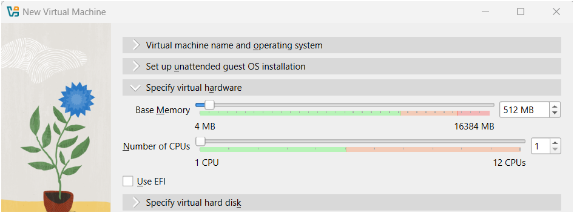

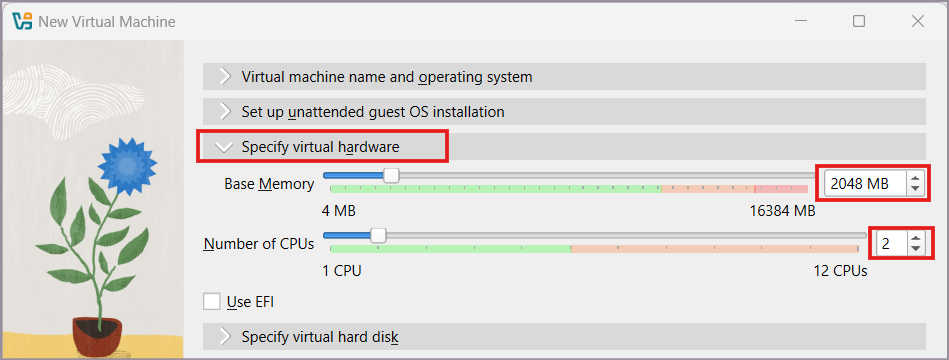

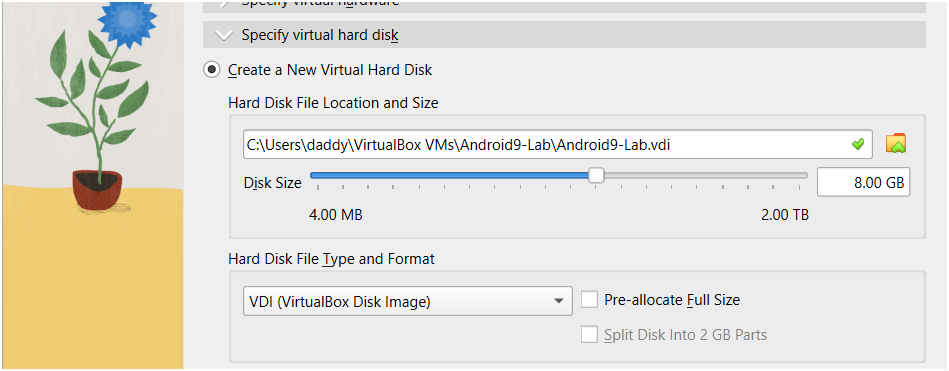

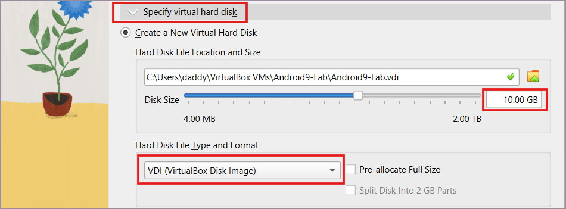

5. **Attached the ISO** under Settings > Storage and configured Display (64 MB video memory, VBoxVGA graphics controller) for compatibility with the Android-x86 installer.

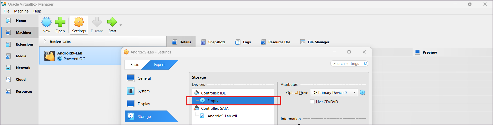

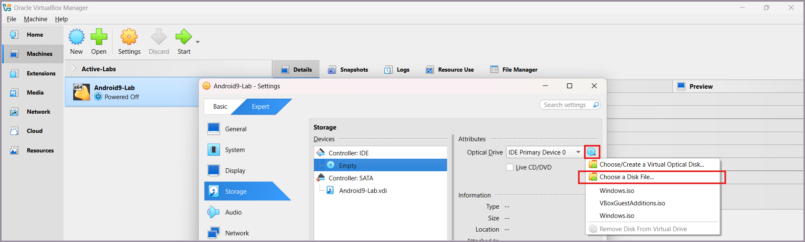

7. **Installed Android-x86 to the virtual hard disk** — partitioned the disk with `cfdisk` (MBR, single bootable primary partition), formatted as ext4, installed the GRUB bootloader, and made the system partition writable.

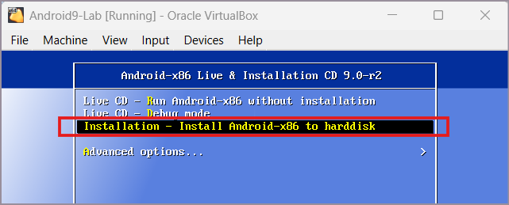

9. **Removed the installation ISO** from the virtual optical drive after the post-install reboot to boot directly into Android.

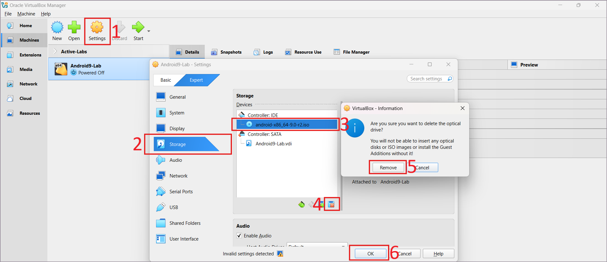

11. **Configured the network adapter** to NAT Network, matching the same NAT Network used by the Kali VM.

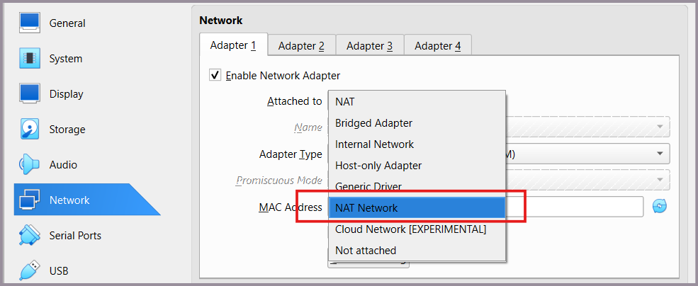

13. **Set a static IP inside Android** (`10.0.0.9/24`, gateway `10.0.0.1`, DNS `8.8.8.8`) via Wi-Fi (VirtWifi) → Advanced options → Static IP settings.

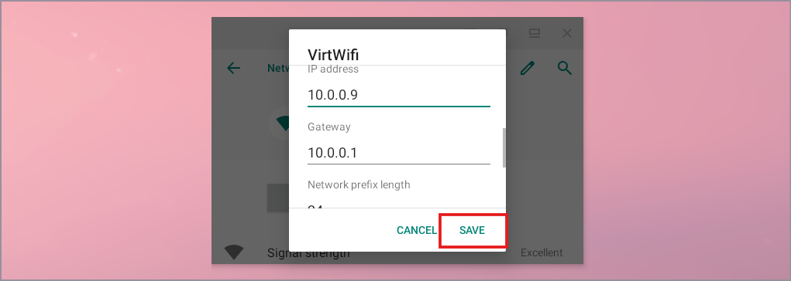

15. **Validated connectivity** in both directions:
   - Android → Kali: `ping 10.0.0.2`
   - Android → Internet: `ping 8.8.8.8`
   - Kali → Android: `ping 10.0.0.9`

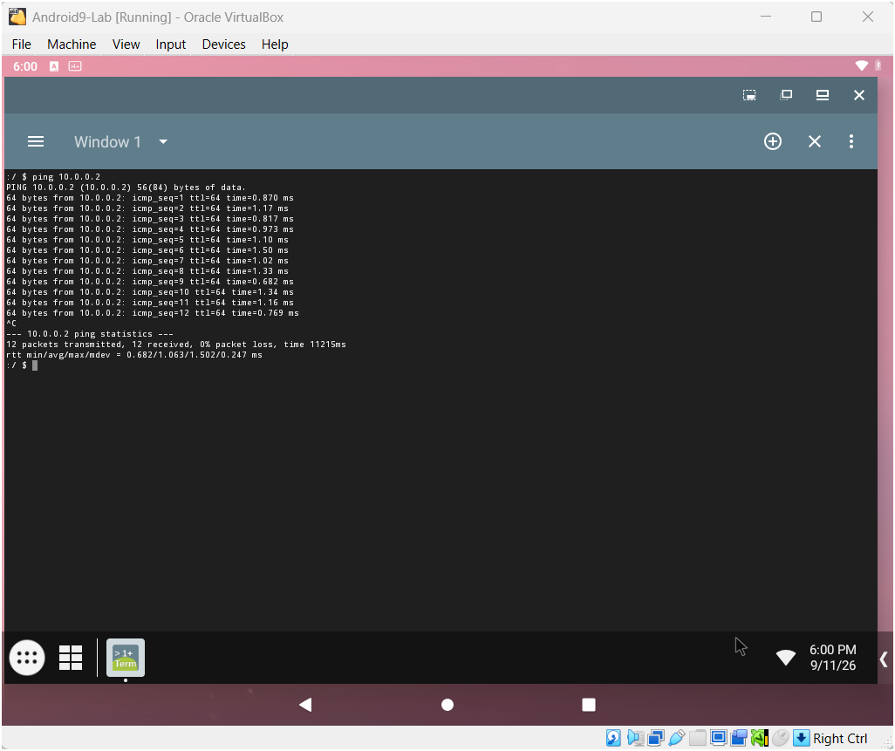

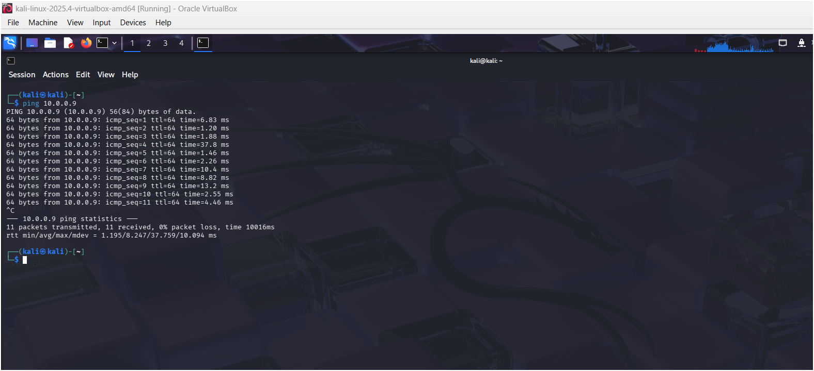

All three pings succeeded, confirming the Android-x86 VM and Kali Linux VM can reach each other and the internet over the shared NAT Network.

## Skills Demonstrated

- Virtual machine provisioning for a non-standard/mobile guest OS
- Manual disk partitioning and filesystem setup (`cfdisk`, ext4, GRUB) in a text-based installer
- Virtual networking (NAT Network configuration across multiple VMs)
- Static IP addressing on Android's network settings
- Network troubleshooting and connectivity validation (ICMP/ping)

## Notes

Together with the Windows 10 build, this Android-x86 VM rounds out a small multi-OS NAT Network lab (Kali + Windows 10 + Android) for use in later reconnaissance and testing exercises in this internship track.

---
*Part of an ongoing cybersecurity portfolio — SOC analysis, penetration testing, and OSINT labs documented as they're completed.*
